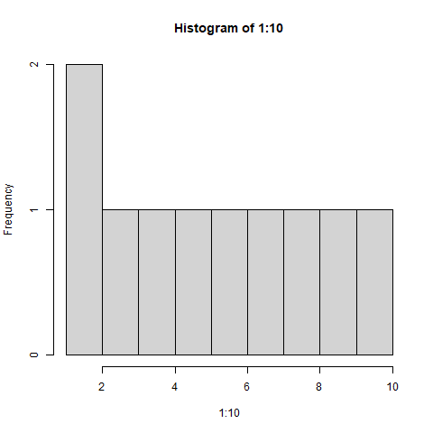
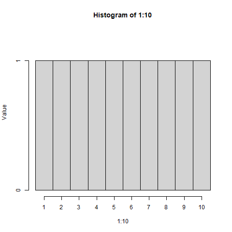

# Table of Contents

1.  [What will you learn?](#orga31a76c)
2.  [Everything is an object video​](#orga9ea6ad)
3.  [Assigning objects (video)​](#org24edf52)
4.  [Why we need vectors (video)](#org74708be)
5.  [R object `class`](#org183587d)
6.  [Creating vectors (video)](#org84a12f0)
7.  [Base R - what's that again?](#org4836f87)
8.  [Example: down the Nile (video)](#org8510599)
9.  [Plotting the nile (video)](#org20145b4)
10. [Plotting the histogram](#orgdc3492e)
11. [Plotting the line plot](#org1b0671f)
12. [Asking for help](#org0d5a705)
13. [Creating sequences and repetitions (video)](#org1b5c042)
14. [The colon `:` operator](#orgb5be175)
15. [Sequences](#orgdf18694)
16. [Solution: odd histogram with colon op `:`](#orgb5a164f)
17. [Repetition](#orge32b5ab)
18. [Repetition with characters](#orgcd98d11)
19. [Sorting and measuring lengths (video)](#orgac5f691)
20. [Sorting vector elements](#org3252636)
21. [Length of vectors](#orgbc944a9)
22. [Practice: creating vectors](#org4d240bf)
23. [Naming vectors](#org505bea3)
24. [Length of `names` vs. vector](#org70bc728)
25. [Indexing vectors](#orge210a50)
26. [Coercion](#orga478bfb)
27. [Summary with examples](#orgb5adb75)
28. [Concept summary](#org420eafc)
29. [Code summary](#org2d27876)
30. [References](#org259a502)

# What will you learn?

After this lesson, you should be able to:

-   Understand assignment in R
-   Creating vectors, sequences and repetitions
-   Sorting and measuring vector length
-   Subsetting and extracting vector elements
-   Vectorizing (rescaling)
-   Classes and logical vectors

*Most sections are accompanied by YouTube videos.*

# Everything is an object [video​](https://youtu.be/7Ab2RQs7Lj8)

-   R is a functional, object-oriented language

-   There are usually many different ways to achive the same result

-   Different solutions differ in: performance, clarity, ease of use

-   PERFORMANCE: important for large data sets only

-   CLARITY: essential when communicating methods, code, results

-   EASE OF USE: determines the fun you have when programming

[[Watch YouTube Playlist Vectors Part I​]​](https://www.youtube.com/playlist?list=PL6SfZh1-kWXl3_YDc-8SS5EuG4h1aILHz)

R is a functional, object-oriented language: everything's an object,
and functions rule, as you already know. Because functions rule,
there are usually many different ways to achieve the same
result. They often differ in terms of performance, ease of use, and
clarity. Performance becomes important when you work with truly
large data sets, otherwise not so much. Ease of use to some extent
determines the fun you do or don't have when using the
language. Clarity is essential when communicating your methods
(including your code) and your results to others. This is not a nice
to have. Views of different packages (like the Tidyverse) differ
massively regarding all of these.

# Assigning objects [(video)​](https://youtu.be/WZqJ_AyoOEU)

-   You can use `<-` or `=` for assignment of values to variables
-   Use `<-` for objects, and `=` to assign function parameters
-   Object names must start with a letter and avoid reserved words

-   Challenge (15 min):
    1.  Create an object `foo` that stores the value 32 &times; 41/8 and
        display it.
        
            foo <- 3**2 * 4**(1/8)
            foo
        
            [1] 10.70286
    
    2.  Overwrite `foo` with itself divided by 2.33. Print the result to
        the console.
        
            foo <- foo / 2.33
            foo
        
            [1] 4.593504
    
    3.  Experiment with different formats and types - look all
        functions that you don't know up using `help`:
        
        1.  Create a new object `bar` with the value -8.2 &times; 10-13 using
            scientific ("e") notation and print it to the console.
        2.  Print `bar` again, but this time **without** scientific notation,
            using the `format` function. Save the result in `barf`
        3.  Check the data type of `barf` with the `class` function.
        4.  Convert `barf` back to a number with the `as.numeric` function.
        
            bar <- -8.2e-13
            bar
            barf <- format(bar, scientific=FALSE)
            barf
            class(barf)
            as.numeric(barf)
        
            [1] -8.2e-13
            [1] "-0.00000000000082"
            [1] "character"
            [1] -8.2e-13
    
    4.  Print the result of multiplying `foo` and `bar` to the console.
        
            foo * bar
        
            [1] -3.766673e-12
    
    5.  Check all variables created in the current session so far with
        `ls`, then delete them with `rm`, and check that they're all gone.
        
            ls()
            rm(list=ls())
            ls()
        
             [1] "bar"       "barf"      "baz"       "foo"       "myseq"     "myseq1"   
             [7] "myvec"     "myvec2"    "myvec3"    "s"         "s_heights" "s_male"   
            [13] "s_names"   "specvec"   "specvec1"  "tgs"       "week"      "workweek" 
            [19] "x"
            character(0)

# Why we need vectors [(video)](https://youtu.be/iFsB_34mnR0)

-   We need vectors to handle multiple items in R
-   Vectors contain observations or measurements of a single variable
-   Each vector can have only one data type - e.g. `numeric` <a id="fnr.1" class="footref" href="#fn.1" role="doc-backlink">1</a>

-   Give three examples of such collections for vectors:
    -   numbers, e.g. the heights of students in this class
    -   text, e.g. the names of students of this class
    -   logical values, e.g. sex of students of this class

-   Define sample vectors `s_heights`, `s_names` and `s_male` using the `c`
    function.

-   Print the vectors.

<b>Solution:</b>

<ol class="org-ol">
<li>the heights of every student of this class, in cm.</li>
<li>the first names of every student of this class (strings).</li>
<li>observations, if a student is male or not male (male means <code>TRUE</code>).</li>
</ol>

Let's put some wood behind the arrow and define sample vectors for these:

    s_heights <- c(180, 181, 158, 175, 179, 168)
    s_names <- c("Vincent", "Natalija", "Adrian", "Andres", "Helena")
    s_male <- c(TRUE, FALSE, TRUE, TRUE, FALSE)
    s_heights
    s_names
    s_male

    [1] 180 181 158 175 179 168
    [1] "Vincent"  "Natalija" "Adrian"   "Andres"   "Helena"
    [1]  TRUE FALSE  TRUE  TRUE FALSE

# R object `class`

-   The function `class` (check the help) returns the R object type

-   Object type is not the same as data type or storage type

-   Besides types there are also data structures (like `vector`)

-   Let's check the class for our three vectors with student data

In order to check what R thinks about your observation or data type,
you can use the function <code>class</code>. Look at the help page for details
and enter the examples at the bottom of the help page.

Let's call <code>class</code> for our three sample vectors:

    class(s_heights) # what type vector is this?
    class(s_names)   # what type vector is this?
    class(s_male)    # what type vector is this?

    [1] "numeric"
    [1] "character"
    [1] "logical"

# Creating vectors [(video)](https://youtu.be/Ov6SIrpY_io)

-   The function to create a vector, or "combine values", is `c()`:
    
        myvec <- c(1,3,1,42) # combine integers as vector
        myvec                # prints 1 3 1 42
        class(myvec)         # determine the data type - "numeric"
    
        [1]  1  3  1 42
        [1] "numeric"

-   Vector elements can be calculations or previously stored items:
    
        foo <- 32.1
        myvec2 <- c(3, -3, 3.45, 1e+03, 64^0.5, 2+(3-1.1)/9.44, foo)
        myvec2
    
        [1]    3.000000   -3.000000    3.450000 1000.000000    8.000000    2.201271
        [7]   32.100000

-   Vector elements can even be vectors themselves:
    
        myvec3 <- c(myvec, myvec2)
        myvec3
        class(myvec3)
    
         [1]    1.000000    3.000000    1.000000   42.000000    3.000000   -3.000000
         [7]    3.450000 1000.000000    8.000000    2.201271   32.100000
        [1] "numeric"

-   In the resulting output, the two vectors were put side by side. The
    new vector now has 11 = 4 + 7 elements.

-   [ ] What about missing values, `NA`, and non-numbers, `NaN`, and what
    about the special values `Inf` and `-Inf` - can you have these in
    vectors, too? Can you think about a way to test this?
    
        specvec <- c(NA, NaN) # a vector with a NA and a NaN
        class(specvec)
        is.nan(specvec)  # testing for NaN values
        is.na(specvec)   # testing for NA values
        specvec1 <- c(specvec, Inf, -Inf) # a new vector with Inf, Inf
        is.finite(specvec1)  # testing for finiteness
        is.infinite(specvec1)  # testing for infiniteness
        class(specvec1)
    
        [1] "numeric"
        [1] FALSE  TRUE
        [1] TRUE TRUE
        [1] FALSE FALSE FALSE FALSE
        [1] FALSE FALSE  TRUE  TRUE
        [1] "numeric"

# Base R - what's that again?

-   Let's not forget that there are real data out there!

-   R (i.e. "[Base R](https://iqss.github.io/dss-workshops/R/Rintro/base-r-cheat-sheet.pdf)") includes a number of built-in datasets
    
    

-   Do you remember how to find these pre-loaded datasets? One of these
    is `Nile`. Do you remember how to get information on such a dataset
    (or on any R object)?

# Example: down the Nile [(video)](https://youtu.be/wwsD2KuoKt8)

-   What data structure is `Nile`?

-   `Nile` contains a so-called "time series", a sequence of numbers that
    correspond to measurements of the annual flow (in billion - 10⁸ -
    cubic meters) of the river Nile at [Aswan](https://en.wikipedia.org/wiki/Aswan), measured between
    1871-1970. You can use `class` to confirm it:
    
        class(Nile)  # what type of dataset is this?
    
        [1] "ts"
    
    

    

    The output is <code>"ts"</code> or time series. You may remember that we
    previously looked at large datasets. <code>mtcars</code> for example was a
    "data frame" (we'll learn more about them later).
    

    
    

-   How can we print this dataset, or parts of it, on the screen?
    
    

    

    <b>Solution:</b> there are different ways to look inside <code>Nile</code>:
    

    
    

    
        str(Nile)   # show dataset structure
        head(Nile)  # show first few elements
        Nile        # this prints the whole dataset
    
         Time-Series [1:100] from 1871 to 1970: 1120 1160 963 1210 1160 1160 813 1230 1370 1140 ...
        [1] 1120 1160  963 1210 1160 1160
        Time Series:
        Start = 1871 
        End = 1970 
        Frequency = 1 
          [1] 1120 1160  963 1210 1160 1160  813 1230 1370 1140  995  935 1110  994 1020  960
         [17] 1180  799  958 1140 1100 1210 1150 1250 1260 1220 1030 1100  774  840  874  694
         [33]  940  833  701  916  692 1020 1050  969  831  726  456  824  702 1120 1100  832
         [49]  764  821  768  845  864  862  698  845  744  796 1040  759  781  865  845  944
         [65]  984  897  822 1010  771  676  649  846  812  742  801 1040  860  874  848  890
         [81]  744  749  838 1050  918  986  797  923  975  815 1020  906  901 1170  912  746
         [97]  919  718  714  740
    
    

    

    
    

    
    

    Because we don't know yet how to look at sub-vectors or individual
    vector elements, we cannot directly check what type the elements of
    <code>Nile</code> have, but the output seems to suggest that the Nile flow is
    measured in integer numbers.
    

    
    

    You can also see from the print output of <code>Nile</code> how row labels
    work: there are 15 numbers per row, and the second row starts with
    the 16th number, indicated by <code>[16]</code>.
    

    
    

# Plotting the nile [(video)](https://youtu.be/c_BvsnKU7T4)

-   Plotting is often a good entry into exploring data

-   `Nile` is a numeric vector of a single, continuous variable over time

-   To visualize such data, *histograms* or *line plots* are useful

-   What you're really after is a picture of a value *distribution*

-   Why are *histograms* called "histograms"?

-   How can you find out more about plotting a histogram in R?
    
    

    

    <b>HELP:</b> You know of course what to do at this point: call for help
    using <code>?hist</code>. Skip to the <code>Examples</code> section at the end, where you find
    the command <code>hist(islands)</code>. This creates a histogram of another
    dataset, <code>islands</code>. With the help of <code>?islands</code>, you find out quickly
    that this is a "named vector of 48 elements". Never mind what this
    means, but you can enter the command, which will generate a
    plot. This is a histogram: it plots frequency of the data and
    distributes them into bins<a id="fnr.2" class="footref" href="#fn.2" role="doc-backlink">2</a>. Let's get back to the river Nile.
    

    
    

    Like most R functions, <code>hist</code> has many options. If you execute
    <code>hist(Nile)</code>, you get the same type of graph as in the example except
    that we know what the data are (annual Nile flow measurements in <code>10⁸
      m³</code>, or 100,000,000 (100 million) of cubic metres.
    

    
    

# Plotting the histogram

-   Let's plot the histogram of `Nile`
    
        hist(Nile)
    
    

-   [ ] **Can you interpret the plot given what you know about the data?**

-   [ ] Add the argument `breaks=20` to the `hist` function call. Change the
    file name in the code block header if you want to create a new PNG file
    
        hist(Nile, breaks=20)
    
    

The <code>hist</code> function creates 10 bins by default and distributes the data
accordingly. You can alter this number of bins by changing the
argument <code>breaks</code>, e.g. <code>hist(Nile, breaks=20)</code> (try it!).

We'll get back to the <code>Nile</code> once we know more about vectors! In the
next four sections, we're going to look at useful functions.

# Plotting the line plot

Since `Nile` is a time series, every data point has a time label

You can easily plot the evolution of the date over time with `plot`

A line plot is useful to visualize two continuous numeric variables

This leads to a so-called *line plot*

    plot(Nile)

-   [ ] **Can you interpret the plot given what you know about the data?**

Is `hist` a generic function?

-   Try to make a histogram of `mtcars`.
-   Check out the structure of `mtcars` to see the column vector data types.
-   Make a histogram of `mtcars$mpg`:
    
        hist(mtcars$mpg)
    
    

Will `hist` work with `factor` vectors? Check out `ToothGrowth`, another
built-in dataset:

    str(ToothGrowth)

    'data.frame':	60 obs. of  3 variables:
     $ len : num  4.2 11.5 7.3 5.8 6.4 10 11.2 11.2 5.2 7 ...
     $ supp: Factor w/ 2 levels "OJ","VC": 2 2 2 2 2 2 2 2 2 2 ...
     $ dose: num  0.5 0.5 0.5 0.5 0.5 0.5 0.5 0.5 0.5 0.5 ...

Try to create a histogram of the `supp` `factor` vector:

    tgs <- ToothGrowth$supp
                                            # hist(tgs) #  Error in hist.default(tgs) : 'x' must be numeric

Can we turn the `factor` values into numbers?

    tgs <- as.numeric(tgs)
    tgs

     [1] 2 2 2 2 2 2 2 2 2 2 2 2 2 2 2 2 2 2 2 2 2 2 2 2 2 2 2 2 2 2 1 1 1 1 1 1 1 1 1 1
    [41] 1 1 1 1 1 1 1 1 1 1 1 1 1 1 1 1 1 1 1 1

Now we can plot the values as a histogram:

    hist(tgs,
         breaks = 2,
         col = "purple",
         border = "white",
         xlab = "Supply type (orange juice/vitamin C)")

For these and other settings, check out `help(hist)`, and `example(hist)`
for the examples listed at the end of the documentation (see next
section).

# Asking for help

-   When you see a new function or dataset, look it up

-   Use fuzzy help search (`??`) or regular help (`?`, `help`)

-   Scroll down to check out (and run) the `examples`

-   Get an overview of the available options

In the following, I won't waste more space with the obvious: whenever
I mention a new function or dataset, or keyword, look the
corresponding help up immediately. More often than not, you will take
something away from it - at the very minimum an example. Over time,
you'll understand things even though you don't know how you possibly
could: this is because you've begun to develop a habit by using a
system of learning - looking up the help content - and the more you
look at help pages, the more you recognize known concepts.

# Creating sequences and repetitions [(video)](https://youtu.be/G2P_MVq3eyM)

# The colon `:` operator

`1:n` creates a sequence of numbers separated by intervals of 1

    3:21

    [1]  3  4  5  6  7  8  9 10 11 12 13 14 15 16 17 18 19 20 21

Check what type of R object `3:21` is by applying the functions:

-   `class` (R object class),
-   `mode` (R object storage mode)
-   `is.vector` (R vector check)
    
        class(3:27)
        mode(3:27)
        is.vector(3:27)
    
        [1] "integer"
        [1] "numeric"
        [1] TRUE
    
    Sequences created this way can also be stored.
    
        foo <- 5.3
        bar <- foo:10
        bar
    
        [1] 5.3 6.3 7.3 8.3 9.3
    
    What happens if the first argument of `:` is smaller than the second?
    
        x <- 10:foo
        x
    
        [1] 10  9  8  7  6
    
    You can perform computations to specify the range.
    
        baz <- foo:(-47+1.5)
        baz
    
         [1]   5.3   4.3   3.3   2.3   1.3   0.3  -0.7  -1.7  -2.7  -3.7  -4.7  -5.7  -6.7
        [14]  -7.7  -8.7  -9.7 -10.7 -11.7 -12.7 -13.7 -14.7 -15.7 -16.7 -17.7 -18.7 -19.7
        [27] -20.7 -21.7 -22.7 -23.7 -24.7 -25.7 -26.7 -27.7 -28.7 -29.7 -30.7 -31.7 -32.7
        [40] -33.7 -34.7 -35.7 -36.7 -37.7 -38.7 -39.7 -40.7 -41.7 -42.7 -43.7 -44.7
    
    

    

    Try to understand what happened here by checking the numbers: the
    first value of the sequence is <code>foo = 5.3</code>. The last value is a
    negative value, <code>-47+1.5 = -45.5</code>. In order to generate the
    sequence, R counts down in steps of <code>1</code> from the first to the last
    value. It stops at <code>-44.7</code>, because the next value, <code>-45.7</code> would be
    outside of the interval \([5.3,-45.5])\).
    

    
    

## Challenge: weird histogram

The following code creates a weird histogram:

    hist(1:10, breaks=10)

What can you do to see the proper distribution with breaks at every
number (all bars should have height 1)? See below for the solution.

# Sequences

The function `seq` allows modifying the step-width with `by`:

    seq(from = 3, to = 27, by = 3)

    [1]  3  6  9 12 15 18 21 24 27

`seq` always starts at `from` but not always end on `to`:

    seq(from=1, to=10, by=2) # range even, stepsize even
    seq(from=1, to=11, by=2) # range odd, stepsize even

    [1] 1 3 5 7 9
    [1]  1  3  5  7  9 11

To end exactly on the last value, use `length.out`:

    seq(from=1, to=10, length.out=10) # either by or length.out
    seq(from = 3, to = 27, length.out = 40)

     [1]  1  2  3  4  5  6  7  8  9 10
     [1]  3.000000  3.615385  4.230769  4.846154  5.461538  6.076923  6.692308  7.307692
     [9]  7.923077  8.538462  9.153846  9.769231 10.384615 11.000000 11.615385 12.230769
    [17] 12.846154 13.461538 14.076923 14.692308 15.307692 15.923077 16.538462 17.153846
    [25] 17.769231 18.384615 19.000000 19.615385 20.230769 20.846154 21.461538 22.076923
    [33] 22.692308 23.307692 23.923077 24.538462 25.153846 25.769231 26.384615 27.000000

What is the step-width in the last case? Compute it and use it
to create a sequence of 40 numbers from 3 to 27 exactly, with `seq`.

<pre class="src src-R">s &lt;- seq(from = 3, to = 27, length.out = 40)
s[2]-s[1] # step-width
seq(from = 3, to = 27, by = s[2]-s[1])
</pre>

<pre class="example">
[1] 0.6153846
 [1]  3.000000  3.615385  4.230769  4.846154  5.461538  6.076923  6.692308  7.307692
 [9]  7.923077  8.538462  9.153846  9.769231 10.384615 11.000000 11.615385 12.230769
[17] 12.846154 13.461538 14.076923 14.692308 15.307692 15.923077 16.538462 17.153846
[25] 17.769231 18.384615 19.000000 19.615385 20.230769 20.846154 21.461538 22.076923
[33] 22.692308 23.307692 23.923077 24.538462 25.153846 25.769231 26.384615 27.000000
</pre>

`length.out` can only be positive (there is no 'negative length').

Create a decreasing sequence of length 5 from 5 to -5. Use
`length.out` first, then use `by` to achieve the same result.

<pre class="src src-R">myseq &lt;- seq(from=5, to=-5, length.out=5)
myseq
myseq1 &lt;- seq(from=5, to=-5, by = -2.5)
myseq1
</pre>

<pre class="example">
[1]  5.0  2.5  0.0 -2.5 -5.0
[1]  5.0  2.5  0.0 -2.5 -5.0
</pre>

# Solution: odd histogram with colon op `:`

When creating a histogram of the vector `1:10` with binwidth 10, the
resulting graph looks wrong:

    hist(1:10, breaks=10)

The code below fixes all problems:

1.  `freq = FALSE` normalizes the diagram so that it shows the density
    (so that the histogram has a total area of one).
2.  `breaks = seq(0.5,10.5,by=1)` puts each integer in its own bin.
3.  `axes = FALSE` removes the axes so that we can redraw them.
4.  `ylim = c(0,0.12)` resets the y-axis values (for the density &isin; [0,0.1]).
5.  The `axis` commands redraw the axis, for the y-axis including labels.

    hist(1:10,
         freq = FALSE,
         breaks = seq(0.5, 10.5, by=1),
         axes = FALSE,
         ylim = c(0, 0.12))
    axis(1, at = 1:10)
    axis(2, at = c(0,0.1), labels = c('0','1'))

# Repetition

-   Use `rep` to repeat a value, e.g. the number 1, four times:
    
        rep( x = 1, times = 4)
    
        [1] 1 1 1 1

-   You can repeat any R object, e.g. the vector `c(3, 62, 8, 3)`, or the
    scalar `foo`, or an arbitrary arithmetic expression:
    
        rep(x=c(3,62,8,3),times=3)
        rep(x=foo, times=2)
        rep(x=2*2, times=(foo*2)) # times must be a positive integer
    
         [1]  3 62  8  3  3 62  8  3  3 62  8  3
        [1] 5.3 5.3
         [1] 4 4 4 4 4 4 4 4 4 4

-   The `each` argument of `rep(x)` says how many times each element of `x` is
    repeated:
    
        rep(x=c(3,62), times=3)  # repeat vector three times
        rep(x=c(3,62), each=2)   # repeat each vector element twice
        rep(x=c(3,62), times=3, each=2) # repeat each vector element twice,
                                                # and repeat the result three times
    
        [1]  3 62  3 62  3 62
        [1]  3  3 62 62
         [1]  3  3 62 62  3  3 62 62  3  3 62 62

-   [ ] The default of `times` and `each` is `1`. What is `rep(c(3,62))` ?
-   As with `seq`, you can include the result of `rep` in a vector of the
    same data type (e.g. `numeric`):
    
        foo <- 4 # store 4 in foo
        
        ## create vector with rep and seq
        c(3, 8.3, rep(x=32,times=foo), seq(from=-2,to=1,length.out=foo+1))
    
        [1]  3.00  8.30 32.00 32.00 32.00 32.00 -2.00 -1.25 -0.50  0.25  1.00

# Repetition with characters

-   `rep` also works for characters and character vectors:
    
        rep(x="data science", times=2)
        rep(x=c("data","science"), times=2)
        rep(x=c("data","science"), times=2, each=2)
    
        [1] "data science" "data science"
        [1] "data"    "science" "data"    "science"
        [1] "data"    "data"    "science" "science" "data"    "data"    "science" "science"

-   [ ] What happens if you try to mix characters, numbers, Booleans?
    Repeat an expression that has all three data types in it.
    
        rep(x=c("data", 1, TRUE), times=2)
    
        [1] "data" "1"    "TRUE" "data" "1"    "TRUE"
    
    

    

    When you call a function with an argument of the wrong
    type, or, as in the case of <code>c</code>, you try to create a vector of
    different data types, R responds with "<a href="https://www.oreilly.com/library/view/r-in-a/9781449358204/ch05s08.html">coercion</a>" to make it happen.
    

    
    

# Sorting and measuring lengths [(video)](https://youtu.be/KRghGmuS6Ck)

# Sorting vector elements

-   *Sorting* is important because we don't care about memory locations

-   `sort(x)` arranges the elements of x according to size

-   The default order is ascending, or `decreasing = FALSE`
    
        sort(x = c(2.5, -1, -10, 3.44))  # sort ascending
        sort(x = c(2.5, -1, -10, 3.44), decreasing = FALSE) # sort ascending
        sort(x = c(2.5, -1, -10, 3.44), decreasing = TRUE)  # sort descending
    
        [1] -10.00  -1.00   2.50   3.44
        [1] -10.00  -1.00   2.50   3.44
        [1]   3.44   2.50  -1.00 -10.00

-   Special values are removed, put last or first with `na.last`. This
    works for all special values - `NA`, `NaN` and `Inf`.
    
        sort(x = c(2.5, -1, -10, 3.44,NA), na.last=TRUE)  # put NA last
        sort(x = c(2.5, -1, -10, 3.44,NaN), na.last=TRUE) # put NaN last
        sort(x = c(2.5, -1, -10, 3.44,Inf), na.last=TRUE) # put Inf last
        sort(x = c(2.5, -1, -10, 3.44,NA), na.last=FALSE) # put NA first
        sort(x = c(2.5, -1, -10, 3.44,NA), na.last=NA)    # remove NA
    
        [1] -10.00  -1.00   2.50   3.44     NA
        [1] -10.00  -1.00   2.50   3.44    NaN
        [1] -10.00  -1.00   2.50   3.44    Inf
        [1]     NA -10.00  -1.00   2.50   3.44
        [1] -10.00  -1.00   2.50   3.44

-   [ ] Remember that `NA` is a `logical` object. How can you check that?
    
        class(NA)
    
        [1] "logical"

# Length of vectors

-   The `length` function gets or sets the length of vectors<a id="fnr.3" class="footref" href="#fn.3" role="doc-backlink">3</a>:
    
        length(x = c(3,2,8,1,10))  # vector of 5 elements
        length(x = 5:13)           # vector of 9 elements
        length(x = c(3,2,2^3,5*3)) # vector of 4 elements
        length(1000)               # scalar/vector of 1 element
    
        [1] 5
        [1] 9
        [1] 4
        [1] 1

-   If you have functions inside the object definition, `length` gives you
    the number of entries *after* the inner functions have been executed:
    
        foo <- 4
        bar <- c(3,8.3,rep(x=32,times=foo),seq(from=-2,to=1,length.out=foo+1))
        bar
        length(bar)
    
         [1]  3.00  8.30 32.00 32.00 32.00 32.00 -2.00 -1.25 -0.50  0.25  1.00
        [1] 11

-   [ ] R's display options are stored in `options()`, which is a
    `list`. Lists have a length like options. How many options does
    `options()` have?
    
        class(options())   # class of options()
        length(options())  # length of options() : number of options
        class(options)     # class of options as a function
        class(options()$digits) # class of one options() element
        length(options()$digits) # length of one options() element
    
        [1] "list"
        [1] 66
        [1] "function"
        [1] "integer"
        [1] 1

# Practice: creating vectors

-   Practice what you've learnt by solving problems independently.
-   You find the practice file in [here in DataCamp workspace](https://app.datacamp.com/workspace/w/5216b6fe-cb9d-4f83-81cb-5105a35d0ccc/edit).

# Naming vectors

-   Naming vector elements makes code more readable.
    
        c(apple = 1, banana = 2, "kiwi fruit" = 3, 4)
    
        apple     banana kiwi fruit            
            1          2          3          4

-   Or you can name elements explicitly using the function `names`<a id="fnr.4" class="footref" href="#fn.4" role="doc-backlink">4</a>
    
        x <- 1:4
        names(x) <- c("apple", "bananas", "kiwi fruit", "")
        x
        names(x)
    
             apple    bananas kiwi fruit            
                 1          2          3          4
        [1] "apple"      "bananas"    "kiwi fruit" ""

-   Looking under the hood of `names`:
    
        foo <- 1:4  # vector 1,2,3,4
        names(foo)  # vector is not named (NULL)
        names(foo) <- letters[1:4]  # assign letter names
        names(foo)
        foo  # default display includes names
        str(foo)  # structures reveals names as attributes
        attributes(foo) # attributes is a list of 1 element, $names
        str(attributes(foo))
    
        NULL
        [1] "a" "b" "c" "d"
        a b c d 
        1 2 3 4
         Named int [1:4] 1 2 3 4
         - attr(*, "names")= chr [1:4] "a" "b" "c" "d"
        $names
        [1] "a" "b" "c" "d"
        List of 1
         $ names: chr [1:4] "a" "b" "c" "d"

# Length of `names` vs. vector

-   What if your names are too short (or too long) for your vector?

-   Define a vector `week` whose elements are the names of weekdays
    
        week <- c("Mon", "Tue", "Wed", "Thu", "Fri", "Sat", "Sun")
        week
    
        [1] "Mon" "Tue" "Wed" "Thu" "Fri" "Sat" "Sun"

-   Define a vector `foo` that contains seven numbers, and name its
    elements according to the `week`.
    
        foo <- 1:7
        names(foo) <- week
        foo
    
        Mon Tue Wed Thu Fri Sat Sun 
          1   2   3   4   5   6   7

-   Copy `week` to `workweek`, and remove `"Saturday"` and `"Sunday"` from the
    `workweek`.
    
        workweek <- week[1:5] # or week[-(6:7)]
        workweek
    
        [1] "Mon" "Tue" "Wed" "Thu" "Fri"

-   Copy `foo` to `bar`, and overwrite `names(bar)` with `workweek`.
    
        bar <- foo
        bar
        names(bar) <- workweek
        names(bar[6:7])  # names of the last two elements missing - NA
        names(bar) <- NULL # remove names altogether
        bar
    
        Mon Tue Wed Thu Fri Sat Sun 
          1   2   3   4   5   6   7
        [1] NA NA
        [1] 1 2 3 4 5 6 7

# Indexing vectors

-   Passing a vector of positive numbers returns the slice of the
    vector containing the elements at those locations.
    
        x <- (1:5)^2   # example vector
        x
        x[1] # extract the first element only
        x[c(1,3,5)] # extract elements with indices 1,3,5
    
        [1]  1  4  9 16 25
        [1] 1
        [1]  1  9 25

-   Passing a vector of negative numbers returns the slice of the vector
    containing the elements everywhere except at those locations.
    
        x[c(-2,-4)]
    
        [1]  1  9 25

-   Passing a logical vector returns the slice of the vector containing
    the elements where the index is `TRUE`.
    
        x[c(TRUE, FALSE, TRUE, FALSE, TRUE)]
    
        [1]  1  9 25

-   For named vectors, passing a character vector of names returns the
    slice of the vector containing the elements with those names.
    
        names(x) <- c("one", "four", "nine", "sixteen", "twenty five")
        x[c("one", "nine", "twenty five")]
    
        one        nine twenty five 
          1           9          25

# Coercion

-   All vector elements have to be of the same `class` or type

-   When you try to mix them, R will create vectores with "coercion":
    
        foo <- c("a",NA,1)
        foo
        class(foo)  # foo becomes a character vector
    
        [1] "a" NA  "1"
        [1] "character"

-   Missing values `NA` are not coerced to `character` (e.g. `"NA"`) because
    this would mean altering their main property, to be missing.

-   Still, the whole vector is a `character` vector object:
    
        mode(foo)  # R storage mode
        class(foo) # R object class
    
        [1] "character"
        [1] "character"

-   You can also explicitly convert elements using the functions
    `as.character`, `as.logical` or `as.numeric`.
    
        as.character(c(1,2,TRUE)) # convert vector to character values
        as.numeric(c("a",2,TRUE)) # R turns characters and Booleans into NA
        as.logical(c("a",0,TRUE)) # R turns characters and numerics into NA
    
        [1] "1" "2" "1"
        [1] NA  2 NA
        Warning message:
        NAs introduced by coercion
        [1]   NA   NA TRUE

-   Conversion with `as.logical` has a surprise: any non-zero number is
    turned into `TRUE` if the vector is `numeric`.
    
        as.logical(c(1,0,-1, 0.333, -Inf, NaN ))
    
        [1]  TRUE FALSE  TRUE  TRUE  TRUE    NA

-   The lesson: don't mix data types in vectors if you can avoid it!

# Summary with examples

-   R is a functional language in which everything's an object.
-   R functions differ in: performance (speed), ease-of-use and
    clarity.
-   To assign values to objects, use the `<-` operator.
-   To assign values to arguments in functions, use the `=` operator.
-   The elements of a numeric, character or logical vector are
    numbers, letters or truth values.
-   A vector can have arithmetic calculations or vectors as elements.
-   A histogram distributes data by frequency across evenly spaced
    bins.
-   Sequences of numbers can be created using the colon operator, or
    the functions `seq` or `rep`.
-   Vectors can be sorted with `sort` in either direction.
-   Vector length can be measured as the number of vector elements with `length`.
-   Index vectors can be used to select sub-vectors.
-   Negative index values delete the corresponding vector elements
    
    **R CODE EXAMPLES:**
    
    <table border="2" cellspacing="0" cellpadding="6" rules="groups" frame="hsides">
    
    
    <colgroup>
    <col  class="org-left" />
    
    <col  class="org-left" />
    </colgroup>
    <tbody>
    <tr>
    <td class="org-left"><code>x &lt;- 5</code></td>
    <td class="org-left">assign <code>5</code> to object <code>x</code></td>
    </tr>
    
    
    <tr>
    <td class="org-left"><code>x &lt;- x+1</code></td>
    <td class="org-left">overwrite <code>x</code> (new value)</td>
    </tr>
    
    
    <tr>
    <td class="org-left"><code>c(1,2,3,4)</code></td>
    <td class="org-left">define (numerical) vector</td>
    </tr>
    
    
    <tr>
    <td class="org-left"><code>class(bar)</code></td>
    <td class="org-left">check type of object <code>bar</code></td>
    </tr>
    
    
    <tr>
    <td class="org-left"><code>hist(x,breaks=foo)</code></td>
    <td class="org-left">histogram of dataset <code>x</code> with <code>foo</code> bins</td>
    </tr>
    
    
    <tr>
    <td class="org-left"><code>m:n</code></td>
    <td class="org-left">sequence <code>m</code> to <code>n</code> at intervals <code>= 1</code></td>
    </tr>
    
    
    <tr>
    <td class="org-left"><code>seq(from=foo,to=bar,by=baz)</code></td>
    <td class="org-left">sequence from <code>foo</code> to <code>bar</code> intervals <code>=baz</code></td>
    </tr>
    
    
    <tr>
    <td class="org-left"><code>seq(from=foo,to=bar,length.out=fuz)</code></td>
    <td class="org-left">seq. <code>foo</code> to <code>bar</code>, <code>fuz</code> equal intervals</td>
    </tr>
    
    
    <tr>
    <td class="org-left"><code>rep(x=foo,times=bar,each=baz)</code></td>
    <td class="org-left">repeat <code>foo</code> times <code>bar</code>, and</td>
    </tr>
    
    
    <tr>
    <td class="org-left">&#xa0;</td>
    <td class="org-left">repeat each element of <code>foo</code> times <code>baz</code></td>
    </tr>
    
    
    <tr>
    <td class="org-left"><code>vector("numeric",foo), numeric(foo)</code></td>
    <td class="org-left">empty numeric vector of length <code>foo</code></td>
    </tr>
    
    
    <tr>
    <td class="org-left"><code>vector("character",foo), character(foo)</code></td>
    <td class="org-left">empty numeric vector of length <code>foo</code></td>
    </tr>
    
    
    <tr>
    <td class="org-left"><code>vector("logical",foo), logical(foo)</code></td>
    <td class="org-left">empty numeric vector of length <code>foo</code></td>
    </tr>
    
    
    <tr>
    <td class="org-left"><code>sort(x=foo, decreasing=FALSE)</code></td>
    <td class="org-left">sort vector <code>foo</code> from smallest to largest</td>
    </tr>
    
    
    <tr>
    <td class="org-left"><code>sort(x=foo, decreasing=TRUE)</code></td>
    <td class="org-left">sort vector <code>foo</code> from largest to smallest</td>
    </tr>
    
    
    <tr>
    <td class="org-left"><code>length(x=foo)</code></td>
    <td class="org-left">print length of vector <code>foo</code></td>
    </tr>
    
    
    <tr>
    <td class="org-left"><code>[n]</code>, <code>[n:m]</code>, <code>[-n]</code></td>
    <td class="org-left">indices <code>n</code>, <code>n</code> to <code>m</code>, deleting element <code>n</code></td>
    </tr>
    
    
    <tr>
    <td class="org-left"><code>prod(foo)</code>, <code>sum(foo)</code></td>
    <td class="org-left">multiply / sum up all elements of vector foo</td>
    </tr>
    
    
    <tr>
    <td class="org-left"><code>names(x)</code></td>
    <td class="org-left">return names of vector <code>x</code> (or <code>NULL</code>)</td>
    </tr>
    
    
    <tr>
    <td class="org-left"><code>as.character</code>, <code>as.numeric</code>, <code>as.logical</code></td>
    <td class="org-left">coerce arguments to the resp. class</td>
    </tr>
    </tbody>
    </table>

# Concept summary

-   In R mathematical expressions are evaluated according to the
    *PEMDAS* rule.

-   The natural logarithm $ln(x)$ is the inverse of the exponential
    function ex.

-   In the scientific or e-notation, numbers are expressed as positive
    or negative multiples of 10.

-   Each positive or negative multiple shifts the digital point to the
    right or left, respectively.

-   Infinity `Inf`, not-a-number `NaN`, and not available numbers `NA`
    are *special values* in R.

# Code summary

<table border="2" cellspacing="0" cellpadding="6" rules="groups" frame="hsides">

<colgroup>
<col  class="org-left" />

<col  class="org-left" />
</colgroup>
<thead>
<tr>
<th scope="col" class="org-left">CODE</th>
<th scope="col" class="org-left">DESCRIPTION</th>
</tr>
</thead>

<tbody>
<tr>
<td class="org-left"><code>log(x=,b=)</code></td>
<td class="org-left">logarithm of <code>x</code>, base <code>b</code></td>
</tr>

<tr>
<td class="org-left"><code>exp(x)</code></td>
<td class="org-left">\(e^x\), exp[onential] of \(x\)</td>
</tr>

<tr>
<td class="org-left"><code>is.finite(x)</code></td>
<td class="org-left">tests for finiteness of <code>x</code></td>
</tr>

<tr>
<td class="org-left"><code>is.infinite(x)</code></td>
<td class="org-left">tests for infiniteness of <code>x</code></td>
</tr>

<tr>
<td class="org-left"><code>is.nan(x)</code></td>
<td class="org-left">checks if <code>x</code> is not-a-number</td>
</tr>

<tr>
<td class="org-left"><code>is.na(x)</code></td>
<td class="org-left">checks if <code>x</code> is not available</td>
</tr>

<tr>
<td class="org-left"><code>all.equal(x,y)</code></td>
<td class="org-left">tests near equality</td>
</tr>

<tr>
<td class="org-left"><code>identical(x,y)</code></td>
<td class="org-left">tests exact equality</td>
</tr>

<tr>
<td class="org-left"><code>1e2</code>, <code>1e-2</code></td>
<td class="org-left">\(10^{2}=100\), \(10^{-2}=\frac{1}{100}\)</td>
</tr>
</tbody>
</table>

# References

-    Richard Cotton (2013). [Learning R.](http://duhi23.github.io/Analisis-de-datos/Cotton.pdf) O'Reilly Media.

-    Tilman M. Davies (2016). [The Book of R. (No Starch
    Press).](https://nostarch.com/bookofr)

-    Rafael A. Irizarry (2020). [Introduction to Data Science](https://rafalab.github.io/dsbook/)
    (also: CRC Press, 2019).

-    Norman Matloff (2020). [fasteR: Fast Lane to Learning R!](https://github.com/matloff/fasteR).
    

# Footnotes

<a id="fn.1" href="#fnr.1">1</a> Note: If a vector contains different data types, R coerces the
vector elements to conform to one type, as we will see later. A data
type that can hold any type of value is called a `list`.

<a id="fn.2" href="#fnr.2">2</a> The [Wikipedia entry for "histogram"](https://en.wikipedia.org/wiki/Histogram) is not bad as a start, lots
of examples and you'll soon find out how to make these yourself! The
origin of the name "histogram" is not clear - it was probably invented
by Pearson, who introduced this type of graph, and is short for
"HISTorical diaGRAM".

<a id="fn.3" href="#fnr.3">3</a> Both `length` and `sort`, as you can read in the respective help
pages, work both for vectors and for factors. These are necessary
whenever we deal with qualities or categories (like "male" or
"female") rather than quantities. You'll learn about them soon!

<a id="fn.4" href="#fnr.4">4</a> You should look up the examples in `help(names)`: the data set
`islands` is a named vector suited to play around with vector naming.
